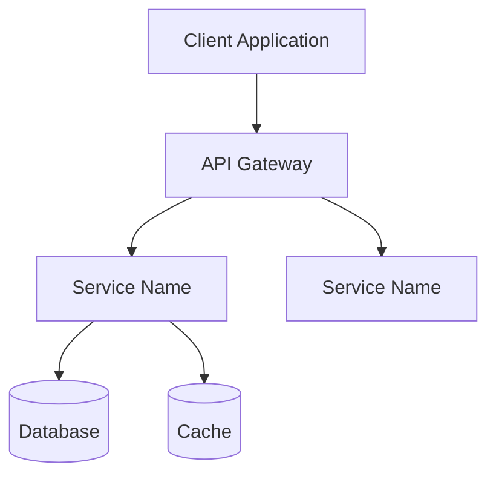
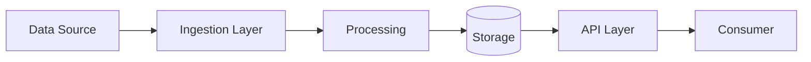
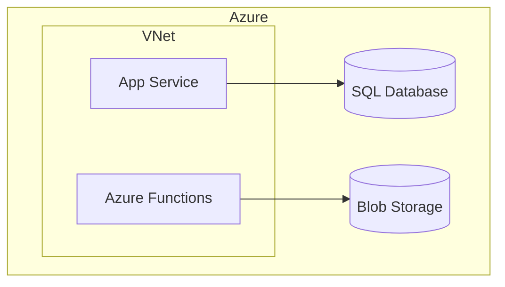

# Portfolio Showcase Generator

A comprehensive skill for transforming technical projects into professional portfolio pieces optimized for different audiences (recruiters, hiring managers, architects, technical leads).

## Core Capabilities

1. **Code Analysis** - Analyze GitHub repository structure, tech stack, architectural patterns
2. **Audience Adaptation** - Generate content for executives, architects, and technical teams
3. **Architecture Visualization** - Create system, data flow, and deployment diagrams
4. **Impact Quantification** - Extract and present business metrics and technical achievements
5. **Multi-Format Output** - Executive summaries, technical deep-dives, interview stories, GitHub Pages

## When to Use This Skill

Use this skill when the user wants to:
- Transform a technical project into portfolio materials
- Create compelling case studies from their work
- Generate interview preparation materials (STAR format stories)
- Build a professional GitHub Pages showcase
- Extract business impact from technical achievements
- Create audience-specific project summaries

## Input Formats

The skill accepts multiple input formats:

### 1. GitHub Repository
- Repository URL or local path
- Analyzes: file structure, code patterns, tech stack, dependencies, documentation
- Extracts: architectural patterns (DDD, microservices, etc.), frameworks, cloud services

### 2. Project Context (any combination)
- **Raw notes/bullets** - Quick captures of achievements and details
- **Technical specs** - Architecture docs, design documents
- **Conversational** - User describes the project naturally
- **Existing documentation** - README files, wikis, ADRs

### 3. Business Context
- Project goals and objectives
- Problems solved
- Stakeholders and users
- Timeline and team size
- Constraints and challenges

## Output Generation

### 1. Executive Summary (For Hiring Managers/Recruiters)

**Purpose**: Quick, high-impact overview focused on business value and results.

**Structure**:
- **Project Overview** (2-3 sentences): What it is, why it matters
- **Key Achievements** (3-5 bullets): Quantified business impact
- **Technical Highlights** (brief): Notable technologies/approaches
- **Timeline & Scope**: Duration, team size, role
- **Impact Metrics**: Performance gains, cost savings, user metrics

**Tone**: Professional, confident, results-focused. Minimize jargon. Lead with outcomes.

**Length**: 150-250 words (30-60 second read)

### 2. Technical Deep-Dive (For Architects/Tech Leads)

**Purpose**: Demonstrate architectural thinking, technical depth, and engineering judgment.

**Structure**:
- **Context & Constraints**: Requirements, constraints, existing systems
- **Architectural Decisions**: Key design choices with rationale
- **Technical Implementation**: 
  - System architecture
  - Tech stack and why
  - Patterns applied (DDD, CQRS, event sourcing, etc.)
  - Integration points
- **Challenges & Solutions**: Technical problems and how you solved them
- **Scale & Performance**: Metrics, optimization strategies
- **Security & Quality**: Testing, observability, security measures
- **Trade-offs**: What you optimized for, what you sacrificed, why

**Tone**: Technical but accessible. Explain reasoning, not just choices. Show judgment.

**Length**: 800-1500 words (4-6 minute read)

### 3. Architecture Diagrams (Mermaid)

Generate relevant diagrams based on project type:

**System Architecture Diagram**:


**Data Flow Diagram**:


**Deployment Diagram**:


**Guidelines**:
- Use appropriate diagram type for the content
- Keep diagrams focused (5-12 nodes maximum)
- Use clear, descriptive labels
- Include legend if needed for colors/shapes
- Generate multiple diagrams if project is complex

### 4. Metrics & Impact Analysis

Extract and present quantifiable achievements:

**Technical Metrics**:
- Performance improvements (response time, throughput, etc.)
- Scalability achievements (users supported, transactions/sec)
- Code quality (test coverage, defect reduction)
- Reliability (uptime, MTTR, error rates)
- Security improvements (vulnerabilities addressed, compliance met)

**Business Metrics**:
- Cost savings (infrastructure, development time)
- Revenue impact (new capabilities, market expansion)
- Efficiency gains (automation, reduced manual work)
- User satisfaction (NPS, adoption rates)
- Time to market (delivery speed, release frequency)

**Format**: Present as concrete numbers with context:
- "Reduced API response time by 60% (450ms → 180ms)"
- "Cut cloud costs by $24K/year through resource optimization"
- "Enabled 10x scale from 1K → 10K concurrent users"

### 5. Interview Preparation (STAR Format)

Generate 2-4 compelling stories in STAR format:

**Structure**:
- **Situation**: Context, problem, constraints (2-3 sentences)
- **Task**: Your specific responsibility (1-2 sentences)
- **Action**: What you did, technical decisions, implementation (3-5 sentences)
- **Result**: Outcomes, metrics, impact (2-3 sentences)

**Length**: Each story should be 90-120 seconds when spoken

**Focus**: Different stories should highlight:
- Technical problem-solving
- Architectural decision-making
- Leadership/influence
- Handling constraints/trade-offs

### 6. GitHub Pages Site

Generate a complete static site structure:

**Homepage** (`index.html`):
- Hero section with project name and tagline
- Quick stats (tech stack, timeline, impact metrics)
- Navigation to sections
- Screenshot/demo if available

**Architecture Page** (`architecture.html`):
- System overview
- Architecture diagrams (embedded Mermaid)
- Tech stack details
- Design decisions

**Impact Page** (`impact.html`):
- Business outcomes
- Technical achievements
- Metrics visualization
- Before/after comparisons

**Demo Page** (`demo.html` - if applicable):
- Interactive demo or walkthrough
- Screenshots with annotations
- Usage scenarios
- Video embed if available

**Styling**:
- Clean, professional design
- Mobile-responsive
- Fast loading (minimal dependencies)
- Accessible (WCAG compliant)
- Optional: Use GitHub's Primer CSS or Tailwind CDN

## Workflow

### Step 1: Gather Input

1. **Ask for project source**:
   - GitHub repo URL/path
   - Existing documentation
   - Project notes

2. **Understand context**:
   - What problem did this solve?
   - Who was it for?
   - What was your role?
   - What made it challenging?
   - What were the results?

3. **Clarify outputs**:
   - Which deliverables do they need?
   - Any specific requirements (length, focus areas)?
   - Target audience details?

### Step 2: Analyze (if GitHub repo provided)

Use bash/view tools to analyze repository:

```bash
# Analyze repository structure
find /path/to/repo -type f -name "*.cs" -o -name "*.csproj" | head -20
find /path/to/repo -type f -name "*.yml" -o -name "*.yaml"

# Check for architecture docs
find /path/to/repo -type f -name "*.md" | grep -i "architecture\|design\|adr"

# Analyze dependencies
cat /path/to/repo/*.csproj
cat /path/to/repo/package.json
cat /path/to/repo/requirements.txt

# Check for configuration
find /path/to/repo -name "appsettings*.json" -o -name "*.config"
```

Extract:
- **Tech stack**: Languages, frameworks, databases, cloud services
- **Patterns**: DDD, microservices, event-driven, CQRS, etc.
- **Architecture**: Monolith, microservices, serverless, etc.
- **Infrastructure**: Cloud provider, deployment strategy
- **Quality practices**: Testing, CI/CD, monitoring

### Step 3: Generate Content

Generate each requested output type following the structures above.

**Key principles**:
- **Audience-first**: Match depth and jargon to audience
- **Evidence-based**: Ground claims in code/docs when possible
- **Quantify**: Always try to include numbers and metrics
- **Story-driven**: Emphasize challenges → solutions → impact
- **Honest**: Acknowledge constraints and trade-offs

### Step 4: Create Artifacts

For documents (summaries, deep-dives):
- Use markdown format
- Include clear sections with headers
- Add code snippets where relevant
- Embed diagrams

For GitHub Pages:
- Generate complete HTML files
- Include inline CSS or reference CDN
- Ensure mobile responsiveness
- Add meta tags for SEO

For diagrams:
- Use Mermaid Chart tool to render
- Provide both Mermaid source and rendered image
- Ensure diagrams are self-explanatory

### Step 5: Package Deliverables

Organize outputs based on user needs:

**For job applications**:
- Executive summary (copy/paste ready)
- 2-3 STAR stories
- Key metrics list

**For portfolio site**:
- Complete GitHub Pages structure
- All assets organized
- Deployment instructions

**For interviews**:
- STAR stories (printed/PDF)
- Architecture diagram (for whiteboarding reference)
- Metrics cheat sheet

## Special Considerations

### .NET/Azure Projects
- Highlight: DDD patterns, SOLID principles, async/await patterns
- Emphasize: Zero Trust, InfoSec compliance, enterprise patterns
- Tech stack: .NET version, Azure services used, design patterns

### Machine Learning/Computer Vision Projects
- Focus: Problem framing, model selection rationale, performance metrics
- Highlight: Training approach, data pipeline, inference optimization
- Metrics: Accuracy, precision, recall, F1, inference latency

### Integration Projects
- Emphasize: API design, error handling, data consistency
- Highlight: Third-party integrations, rate limiting, resilience patterns
- Metrics: Reliability (uptime), data accuracy, throughput

### Enterprise/Large-Scale Projects
- Context: Scale, compliance requirements, legacy constraints
- Highlight: Migration strategies, backward compatibility, risk mitigation
- Metrics: Scale numbers, performance under load, cost optimization

## Output Format

When generating multiple outputs, organize as follows:

```markdown
# Portfolio Showcase: [Project Name]

## Quick Reference
- **Tech Stack**: [List]
- **Duration**: [Timeline]
- **Role**: [Your role]
- **Impact**: [Top 1-2 metrics]

## Outputs Generated

### 1. Executive Summary
[Content]

### 2. Technical Deep-Dive
[Content]

### 3. STAR Stories
#### Story 1: [Title]
[Content]

#### Story 2: [Title]
[Content]

### 4. Architecture Diagrams
[Diagrams with explanations]

### 5. Metrics Dashboard
[Formatted metrics]

### 6. GitHub Pages Files
[File structure and contents]
```

## Quality Checklist

Before delivering, ensure:

- [ ] All metrics are specific and quantified
- [ ] Technical terms are explained or justified for audience
- [ ] Diagrams are clear and properly labeled
- [ ] STAR stories are complete (all 4 elements)
- [ ] Executive summary passes the "elevator pitch" test
- [ ] Technical deep-dive demonstrates architectural thinking
- [ ] GitHub Pages are mobile-responsive and accessible
- [ ] No grammatical errors or typos
- [ ] Consistent terminology throughout
- [ ] Achievements are framed as impact, not just tasks

## Example Prompts

**Simple**: "Create a portfolio showcase for my DocFlow project on GitHub"

**Detailed**: "I built a flight status dashboard using .NET 8, DDD, and Azure. It was the first app deployed to our Zero Trust environment. I need an executive summary for recruiters and a technical deep-dive for the interview, plus architecture diagrams."

**Conversational**: "I want to showcase my AI document scanner project. It uses computer vision to extract data from whiteboards and integrates with multiple systems. Can you help me create materials for my portfolio site?"

## Tips for Users

**To get the best results**:
1. Provide GitHub access if possible (richest information source)
2. Share the "why" behind the project (business context matters)
3. Include any metrics you tracked (even informal ones)
4. Mention challenges you overcame (these make great stories)
5. Specify your target audience (technical depth varies widely)
6. Note what made you proud or what you learned (authentic details resonate)

**Common mistakes to avoid**:
- Being too humble (portfolio is not the place for modesty)
- Listing tasks instead of achievements ("Built API" vs "Designed API that reduced latency by 40%")
- Using jargon without context for non-technical audiences
- Forgetting to quantify impact
- Making it sound like a team report instead of your contribution
