# Portfolio Showcase: FLIFO Flight Status V2.0

## Quick Reference
- **Tech Stack**: .NET 8.0, React, Azure (App Service, SQL, Service Bus), Zero Trust Architecture
- **Duration**: 6 months
- **Role**: Technical Lead & Sole Developer
- **Impact**: First app in new Zero Trust environment, 99.9% uptime, <200ms response time, 10K+ daily updates

---

## 1. Executive Summary (For Hiring Managers/Recruiters)

Led the development and deployment of FLIFO Flight Status V2.0, the first production application in our enterprise's new Zero Trust security architecture. Built a real-time flight operations dashboard integrating data from three separate vendor systems (1200 Aero, C360, Signet) using .NET 8.0 and modern DDD patterns. Achieved 99.9% uptime while supporting 500+ concurrent users and processing 10K+ flight status updates daily with sub-200ms API response times. Successfully replaced a legacy system while establishing architectural patterns and comprehensive InfoSec documentation that became the blueprint for future Zero Trust deployments. Delivered the project solo in 6 months, meeting aggressive timeline and security requirements while maintaining enterprise-grade quality and scalability.

**Key Achievements:**
- First production deployment to Zero Trust environment, establishing security patterns for entire enterprise
- Integrated three disparate vendor APIs into unified real-time data stream with 99.9% reliability
- Achieved <200ms p95 API response time serving 500+ concurrent users
- Created comprehensive DDD-based architecture serving as reference for future .NET projects
- Delivered complete InfoSec documentation package approved by security team

---

## 2. Technical Deep-Dive (For Architects/Tech Leads)

### Context & Constraints

FLIFO Flight Status V2.0 emerged from the need to modernize our legacy flight operations system while simultaneously being the proving ground for our enterprise's first Zero Trust network architecture deployment. The project faced several critical constraints: strict InfoSec requirements including certificate-based authentication, integration with three vendor systems with varying API maturity levels, and aggressive 6-month timeline to establish Zero Trust patterns for other teams to follow.

The existing legacy system suffered from poor reliability, monolithic architecture, and security vulnerabilities. Leadership selected this project as the Zero Trust pilot because flight operations data was critical but had a limited external attack surface, making it ideal for working through security patterns without risking customer-facing systems.

### Architectural Decisions

**Domain-Driven Design (DDD) Architecture**

I structured the solution using DDD principles with clear bounded contexts:

```
FLIFO.Core (Domain Layer)
├── Domain/
│   ├── Entities/ (Flight, Airport, Airline)
│   ├── ValueObjects/ (FlightNumber, FlightStatus, Coordinates)
│   └── Aggregates/ (FlightSchedule with consistency boundaries)
└── Interfaces/ (Repository and service contracts)

FLIFO.Infrastructure (Infrastructure Layer)
├── Data/ (EF Core repositories, SQL persistence)
└── Integration/ (Vendor API clients, data transformation)

FLIFO.API (Application Layer)
├── Controllers/ (REST endpoints)
└── Services/ (Application orchestration, CQRS handlers)
```

This separation enabled clean testing, isolated vendor integration complexity, and created reusable domain models for future projects. The domain layer had zero external dependencies, making it highly testable and portable.

**Multi-Source Data Integration Strategy**

The three vendor APIs (1200 Aero, C360, Signet) each had different characteristics:
- 1200 Aero: REST API, real-time push updates via webhooks
- C360: SOAP-based, required polling every 30 seconds
- Signet: REST with batch endpoints, updates every 5 minutes

I implemented a unified integration layer with vendor-specific adapters implementing a common `IFlightDataProvider` interface. Each adapter normalized data into our domain model and published events to Azure Service Bus. This decoupling meant vendor API changes only affected their specific adapter, not the entire system.

**Event-Driven Architecture with Azure Service Bus**

Rather than having the API directly query vendor systems, I used Service Bus topics with subscriptions for each data source. Background services consumed these messages and updated Azure SQL via repositories. This provided:
- Temporal decoupling (API remained responsive even during vendor outages)
- Message replay capability for debugging
- Natural backpressure handling (Service Bus queuing prevented overload)
- Audit trail of all vendor data changes

**Zero Trust Security Implementation**

The Zero Trust deployment required:
- Certificate-based mutual TLS for all service-to-service communication
- No ambient credentials (all services used Managed Identity)
- Private endpoints for Azure SQL and Service Bus (no public access)
- Network segmentation with Application Security Groups
- Comprehensive audit logging to Log Analytics

I created Azure DevOps pipelines that automated certificate provisioning and rotation, network configuration, and security baseline validation. The InfoSec documentation I produced (threat model, data flow diagrams, certificate management procedures) became the template for subsequent Zero Trust projects.

### Technical Implementation

**Tech Stack Justification:**
- **.NET 8.0**: Latest LTS release, excellent performance, first-class Azure support
- **React SPA**: Modern, maintainable frontend with real-time updates via SignalR
- **Azure App Service**: PaaS for simplified operations, built-in scaling, certificate management
- **Azure SQL**: Relational model fit flight schedules well, strong consistency guarantees
- **Azure Service Bus**: Enterprise-grade messaging, exactly-once delivery, dead-letter handling

**Patterns Applied:**
- **Repository Pattern**: Abstracted data access, simplified unit testing
- **CQRS (lightweight)**: Separate read models optimized for dashboard queries
- **Adapter Pattern**: Unified interface for heterogeneous vendor APIs
- **Saga Pattern**: Coordinated multi-step data validation across sources

### Challenges & Solutions

**Challenge 1: Vendor API Reliability**

1200 Aero's webhook delivery proved unreliable—we'd occasionally miss flight updates. I implemented an idempotent webhook handler combined with a scheduled polling fallback that checked for missed updates every 2 minutes. This hybrid approach gave us real-time updates when webhooks worked (98% of the time) with polling as a safety net, achieving 99.9% data completeness.

**Challenge 2: Zero Trust Network Complexity**

Certificate-based auth added significant deployment complexity. I created PowerShell automation for certificate generation, Key Vault storage, and App Service binding. The automation reduced certificate setup from 2 hours manual work to 10 minutes automated, and prevented configuration errors that had plagued early deployments.

**Challenge 3: Real-Time Dashboard Performance**

Initial dashboard implementation polled the API every 5 seconds, creating unnecessary load. I switched to SignalR for real-time push updates triggered by Service Bus message processing. This reduced API load by 80% and improved perceived responsiveness—users saw updates instantly rather than waiting for polling intervals.

### Scale & Performance

The system consistently met performance targets:
- **API Response Time**: <200ms at p95 (target was <500ms)
- **Throughput**: 10K+ flight updates daily, 500+ concurrent dashboard users
- **Availability**: 99.9% uptime (only one 30-minute outage in 6 months for patching)
- **Data Freshness**: <2 second latency from vendor webhook to dashboard update

Performance optimizations included:
- Redis caching of frequently-accessed reference data (airports, airlines)
- Database indexing strategy based on query profiling
- SignalR backplane using Service Bus for multi-instance scaling
- Async/await throughout to maximize thread utilization

### Security & Quality

**Testing Strategy:**
- Unit tests for domain logic (85% coverage)
- Integration tests for vendor adapters using WireMock for HTTP mocking
- End-to-end tests for critical flows (flight arrival → dashboard update)
- Load testing with K6 simulating 1000 concurrent users

**Observability:**
- Application Insights for distributed tracing and telemetry
- Custom metrics for vendor API latency and error rates
- Alerts for certificate expiration, data freshness SLA violations
- Azure Monitor workbooks for operational dashboards

**Security Measures:**
- All secrets in Key Vault, zero secrets in configuration
- Managed Identity for all Azure resource access
- Network isolation with private endpoints
- OWASP Top 10 vulnerability scanning in CI/CD
- Penetration testing performed by InfoSec team before production

### Trade-offs

**What I Optimized For:**
- **Security compliance**: Zero Trust requirements were non-negotiable, accepted extra deployment complexity
- **Maintainability**: DDD structure and comprehensive tests over rapid initial delivery
- **Reliability**: Hybrid webhook+polling approach added complexity but ensured data completeness

**What I Sacrificed:**
- **Time to market**: 6 months vs. 3-4 months if we'd skipped Zero Trust patterns and gone monolithic
- **Feature scope**: Deferred advanced analytics features to focus on core real-time dashboard
- **Cost optimization**: Used App Service Premium tier for network isolation, more expensive than Basic tier

**Why:**
As the first Zero Trust deployment, establishing repeatable patterns for security, observability, and deployment automation was more valuable than shipping additional features quickly. The infrastructure and documentation I created shortened development time for subsequent Zero Trust projects from 6 months to 2-3 months.

---

## 3. Architecture Diagrams

### System Architecture

```mermaid
graph TB
    subgraph "Client Tier"
        ReactSPA[React Dashboard]
    end
    
    subgraph "API Tier"
        API[FLIFO API<br/>.NET 8.0 Web API]
        SignalR[SignalR Hub<br/>Real-time Updates]
    end
    
    subgraph "Integration Tier"
        Aero1200[1200 Aero Adapter]
        C360[C360 Adapter]
        Signet[Signet Adapter]
        ServiceBus[(Azure Service Bus<br/>Topics & Subscriptions)]
    end
    
    subgraph "Data Tier"
        SQL[(Azure SQL<br/>Flight Data)]
        Cache[(Redis Cache<br/>Reference Data)]
    end
    
    subgraph "External Systems"
        Vendor1[1200 Aero API<br/>Webhooks + REST]
        Vendor2[C360 API<br/>SOAP]
        Vendor3[Signet API<br/>REST Batch]
    end
    
    ReactSPA -->|HTTPS + Cert Auth| API
    ReactSPA -->|WSS| SignalR
    
    API --> SQL
    API --> Cache
    SignalR --> ServiceBus
    
    Vendor1 -->|Webhook| Aero1200
    Aero1200 -->|Poll Fallback| Vendor1
    C360 -->|Poll 30s| Vendor2
    Signet -->|Poll 5min| Vendor3
    
    Aero1200 --> ServiceBus
    C360 --> ServiceBus
    Signet --> ServiceBus
    
    ServiceBus --> API
    API --> SQL
```



### Data Flow Diagram


### Zero Trust Deployment Architecture


**Diagram Explanations:**

1. **System Architecture**: Shows the layered architecture with clear separation of concerns. External vendor APIs feed through dedicated adapters into Service Bus, which decouples data ingestion from API serving. SignalR provides real-time updates to the React dashboard.

2. **Data Flow**: Illustrates how flight updates flow from source systems through normalization, validation, and persistence before being pushed to clients. The event-driven design ensures data consistency and supports audit trails.

3. **Zero Trust Deployment**: Highlights the security architecture with private endpoints (no public access to databases/messaging), certificate-based authentication, and Managed Identity for service-to-service auth. All communication within the Zero Trust boundary uses private networking.

---

## 4. Metrics & Impact Analysis

### Technical Achievements

**Performance:**
- **API Response Time**: <200ms p95 (60% faster than target of 500ms)
- **Data Freshness**: <2 second latency from vendor update to dashboard
- **Throughput**: 10,000+ flight status updates processed daily
- **Concurrency**: Supports 500+ simultaneous dashboard users
- **Availability**: 99.9% uptime (< 9 hours downtime annually)

**Quality:**
- **Test Coverage**: 85% unit test coverage on domain logic
- **Data Accuracy**: 99.9% complete data capture from vendor APIs
- **Zero Security Incidents**: No vulnerabilities in production deployment
- **Certificate Management**: Automated 100% of certificate provisioning and rotation

**Scalability:**
- **Load Tested**: Validated 1,000 concurrent users (2x production peak)
- **Message Throughput**: Service Bus handles 1,000+ messages/minute
- **Database Performance**: Query times <50ms even at peak load

### Business Impact

**Strategic:**
- **First Zero Trust Deployment**: Established security patterns and documentation enabling 8 subsequent Zero Trust projects
- **Vendor SLA Validation**: Identified critical SLA violations (1200 Aero data 2-5 hours stale vs. 30-second contract)
- **Legacy System Replacement**: Decommissioned unreliable system, improving operational confidence

**Operational Efficiency:**
- **Reduced Manual Lookups**: Operators no longer need to check 3 separate vendor portals
- **Faster Incident Response**: Real-time visibility into flight status changes
- **Automated Monitoring**: Alerting on data freshness and API health reduces operational toil

**Technical Enablement:**
- **Reference Architecture**: DDD patterns and project structure adopted by 3 other teams
- **InfoSec Blueprint**: Documentation package reduced security review time from 6 weeks → 2 weeks for future projects
- **CI/CD Templates**: Azure DevOps pipelines reused by 5 other Zero Trust deployments

### Cost Considerations

**Infrastructure Costs:**
- Azure App Service: ~$500/month (Premium tier for VNet integration)
- Azure SQL: ~$300/month (S3 tier)
- Azure Service Bus: ~$200/month (Standard tier)
- **Total Monthly**: ~$1,000/month operational cost

**Development Investment:**
- 6 months development time (1 FTE)
- Opportunity cost accepted to establish Zero Trust patterns

**Long-term Value:**
- Reduced security review time saves ~$20K per project (4 weeks × $5K/week)
- 8 projects leveraged patterns = ~$160K total organizational value
- Legacy system maintenance reduction: ~$50K/year in prevented incidents

---

## 5. STAR Interview Stories

### Story 1: Architecting for Zero Trust (Architectural Decision-Making)

**Situation**: FLIFO was selected as the first application to deploy on our enterprise's new Zero Trust network architecture. We had no established patterns, and InfoSec requirements included certificate-based mutual TLS, private endpoints for all data stores, and zero ambient credentials—all while maintaining a 6-month delivery timeline.

**Task**: As the technical lead and sole developer, I needed to design an architecture that met strict security requirements while remaining maintainable and setting patterns other teams could follow. The architecture had to integrate three vendor APIs with varying maturity levels and support real-time dashboard updates for 500+ users.

**Action**: I designed a layered DDD architecture that isolated security concerns in the infrastructure layer. For Zero Trust compliance, I implemented certificate-based authentication for all service communication, private endpoints for Azure SQL and Service Bus, and Managed Identity for all Azure resource access—eliminating secrets in configuration entirely. I created PowerShell automation for certificate lifecycle management that reduced manual provisioning from 2 hours to 10 minutes and prevented configuration errors. For vendor integration, I built adapter classes implementing a common interface, normalizing data into our domain model before publishing to Service Bus topics. This event-driven approach provided temporal decoupling and message replay capability. I also created comprehensive InfoSec documentation including threat models, data flow diagrams, and certificate management procedures, working closely with the security team to validate the approach.

**Result**: Successfully delivered the first production Zero Trust application on schedule, achieving 99.9% uptime and <200ms API response time. The InfoSec documentation package I created reduced security review time from 6 weeks to 2 weeks for subsequent projects. My architecture patterns and CI/CD templates were adopted by 8 other teams deploying to the Zero Trust environment, compressing their development time from 6 months to 2-3 months. The security team approved the certificate automation approach as the standard for the enterprise.

---

### Story 2: Solving Vendor API Reliability Issues (Technical Problem-Solving)

**Situation**: Three months into production, we discovered critical data freshness issues. The 1200 Aero vendor API used webhooks for real-time updates, but we were intermittently missing flight status changes—sometimes not seeing updates for 15-20 minutes. This violated our <5 minute freshness SLA and eroded operator confidence in the system.

**Task**: I needed to ensure 99.9%+ data completeness while maintaining real-time responsiveness. The challenge was that webhooks are inherently unreliable (network issues, webhook endpoint downtime, vendor-side failures), but polling would increase latency and API load.

**Action**: I implemented a hybrid push-pull strategy. The primary path remained webhooks for real-time updates, but I added a scheduled background job that polled the vendor REST API every 2 minutes to detect missed updates. The job compared our last-known state with the vendor's current state and backfilled any gaps. I made the webhook handler idempotent using the vendor's update timestamp as a natural deduplication key—if we received a webhook and a polling update for the same event, we'd only process it once. I added instrumentation to track webhook delivery success rate and alerting when polling detected too many missed updates (indicating systemic webhook problems). I also worked with the vendor to improve their webhook reliability by diagnosing and reporting several issues in their infrastructure.

**Result**: Achieved 99.9% data completeness—we were catching missed updates within 2 minutes instead of 15-20 minutes. Webhook success rate improved from 87% to 98% after vendor fixed their infrastructure based on my diagnostics. The hybrid approach gave us the best of both worlds: real-time updates when webhooks worked (98% of the time) with polling as an automatic safety net. Operators regained confidence in the system, and the pattern was adopted by two other teams integrating with unreliable external APIs.

---

### Story 3: Optimizing Real-Time Dashboard Performance (Performance & Scalability)

**Situation**: The initial dashboard implementation used polling—refreshing data every 5 seconds by calling the API. This approach had two problems: users experienced noticeable 5-second lag when flights updated, and we were handling 60 API requests per minute per user, creating unnecessary load. With 500 concurrent users, that was 30,000 requests/minute for data that only updated a few times per minute.

**Task**: I needed to improve perceived responsiveness while reducing API load by at least 80%. The solution needed to scale to 1,000+ concurrent users and maintain sub-second latency from vendor update to dashboard display.

**Action**: I replaced polling with SignalR for server-push updates. I modified the Service Bus message handler to publish flight update events to a SignalR hub whenever processing completed. Dashboard clients established persistent WebSocket connections and received updates instantly as they occurred—no polling required. For scalability, I configured SignalR to use Service Bus as a backplane, allowing multiple App Service instances to share connections. I also implemented connection grouping—users only subscribed to updates for flights relevant to their current view (by airport or airline), dramatically reducing per-connection message volume. To maintain reliability, I added heartbeat monitoring and automatic reconnection logic with exponential backoff. For backwards compatibility during rollout, I kept the polling endpoint available but made it opt-in.

**Result**: Reduced API load by 85%—from 30,000 requests/minute to 4,500 requests/minute with 500 users. Dashboard updates became instantaneous (<2 seconds from vendor update to UI display) instead of waiting up to 5 seconds for the next poll. Load testing validated the system could handle 1,000+ concurrent SignalR connections with sub-second latency. User feedback was overwhelmingly positive—operators appreciated seeing updates immediately rather than watching a stale dashboard. The SignalR pattern was subsequently adopted by three other real-time dashboard projects in the organization.

---

### Story 4: Establishing Enterprise Patterns Under Pressure (Leadership & Influence)

**Situation**: As the first Zero Trust deployment, FLIFO carried significant organizational weight. Multiple teams were waiting to see if Zero Trust was viable for their applications. I was working solo on a 6-month timeline with pressure from leadership to demonstrate the approach worked while maintaining enough quality to serve as a reference implementation.

**Task**: I needed to balance delivery speed with establishing patterns that other teams could follow. This meant not just building FLIFO, but documenting architectural decisions, creating reusable automation, and working with InfoSec to validate security approaches—all while keeping the project on schedule.

**Action**: I adopted a "build with documentation" approach. As I solved each challenge (certificate automation, private endpoint configuration, vendor integration patterns), I immediately documented the solution and created reusable artifacts. I wrote detailed ADRs (Architecture Decision Records) explaining not just what I did, but why—including alternatives considered and trade-offs made. I created PowerShell modules for certificate management and Azure DevOps pipeline templates with inline documentation. I scheduled bi-weekly demos with stakeholders and other technical leads, using FLIFO as a live example to discuss Zero Trust patterns. I also volunteered to present at our architecture guild, sharing lessons learned about DDD in .NET 8, event-driven integration, and Zero Trust security. When I identified the 1200 Aero SLA violation, I documented the issue thoroughly and presented it to leadership with evidence—ultimately leading to vendor contract renegotiation.

**Result**: Delivered FLIFO on schedule with comprehensive documentation that reduced subsequent Zero Trust projects from 6 months to 2-3 months development time. My PowerShell automation and CI/CD templates were adopted as enterprise standards, used by 8 teams. The InfoSec documentation package became the template for security reviews—reducing review time from 6 weeks to 2 weeks and saving approximately $160K in total organizational time costs. My ADRs were referenced in architecture guild discussions for 6 months after FLIFO launched. Leadership cited FLIFO as the proof point that enabled broader Zero Trust adoption across the enterprise, and I was recognized with a spot award for the impact.

---

## 6. Additional Assets

### Resume Bullets (Copy/Paste Ready)

**For Software Engineer / Senior Engineer roles:**
- Led development of FLIFO Flight Status V2.0, integrating 3 vendor APIs (.NET 8.0, React, Azure) with 99.9% uptime and <200ms response time serving 500+ concurrent users
- Architected first production Zero Trust deployment using DDD patterns, certificate-based auth, and private endpoints; created documentation reducing security reviews from 6 weeks to 2 weeks
- Implemented event-driven architecture with Azure Service Bus, reducing API load 85% through SignalR real-time updates; validated 1,000+ concurrent connection scalability

**For Staff Engineer / Principal Engineer roles:**
- Established enterprise Zero Trust architecture patterns for .NET 8.0 applications, creating reusable automation and documentation adopted by 8 teams, compressing development time from 6 months to 2-3 months
- Designed multi-vendor data integration strategy (1200 Aero, C360, Signet) with hybrid webhook/polling approach achieving 99.9% data completeness despite unreliable vendor APIs
- Delivered comprehensive reference architecture (DDD, CQRS, event-driven messaging) with 85% test coverage and complete InfoSec compliance, serving as blueprint for enterprise .NET development

**For Architect roles:**
- Architected and delivered FLIFO Flight Status V2.0 as first Zero Trust deployment, establishing security patterns, CI/CD templates, and InfoSec documentation used by $160K+ in organizational follow-on work
- Designed layered DDD architecture with clear bounded contexts, event-driven integration, and CQRS read models; patterns adopted as enterprise standard for .NET 8.0 development
- Created scalable real-time dashboard architecture (SignalR, Service Bus backplane) handling 10K+ daily updates for 500+ users with <2 second end-to-end latency and 99.9% availability

### LinkedIn Profile Summary Enhancement

**Consider adding:**
"Specialized in enterprise architecture and Zero Trust security implementations. Recently architected FLIFO Flight Status V2.0—the first production application in our enterprise's new Zero Trust environment—achieving 99.9% uptime while establishing reusable patterns and documentation adopted by 8+ subsequent projects. Passionate about DDD, event-driven architectures, and building systems that scale."

### Technical Skills to Highlight

Based on FLIFO, emphasize these in applications:
- **Languages & Frameworks**: .NET 8.0, C#, React, TypeScript
- **Cloud & Infrastructure**: Azure (App Service, SQL, Service Bus, Key Vault, Application Insights)
- **Architecture Patterns**: DDD, CQRS, Event-Driven Architecture, Microservices
- **Security**: Zero Trust Architecture, Certificate Management, Managed Identity, Private Endpoints
- **Integration**: REST APIs, Webhooks, SOAP, Message Queuing
- **Real-time**: SignalR, WebSockets
- **DevOps**: Azure DevOps, CI/CD, PowerShell automation, Infrastructure as Code

### Interview Talking Points

**When discussing technical leadership:**
- "I was the sole developer on FLIFO, but I designed it as if a team would inherit it—comprehensive tests, clear documentation, and patterns other teams could follow."

**When discussing architectural decisions:**
- "I chose DDD because flight operations have complex business rules that needed to live in the domain layer. The separation made testing easy and kept vendor integration complexity from polluting our business logic."

**When discussing trade-offs:**
- "The Zero Trust deployment added 2-3 months to the timeline, but it was worth it. The patterns and documentation I created saved 8 other teams about 4 months each—a 30x return on that initial investment."

**When discussing problem-solving:**
- "When webhooks proved unreliable, I didn't just add polling. I instrumented both paths, measured the gap, and built a hybrid that gave us real-time updates 98% of the time with automatic backfilling for the other 2%."

**When discussing impact:**
- "Beyond the technical delivery, FLIFO validated Zero Trust as viable for our organization. My documentation reduced security reviews from 6 weeks to 2 weeks, and teams started shipping faster because they had a proven reference architecture."
